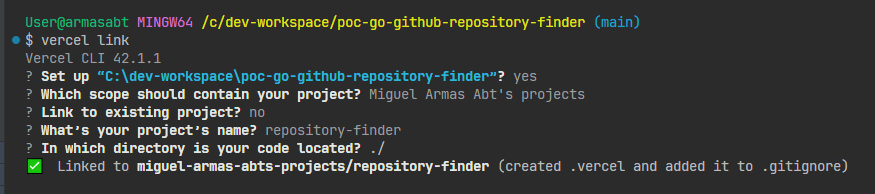

# SEVERLESS CON VERCEL

[← Regresar a notas](../../README.md) <br>

----

> Crear `vercel.json` en la raíz del repositorio git del proyecto.
> 
> Ejemplo para GO:
> ```json
> {
>   "version": 2,
>   "builds": [
>     {
>       "src": "api/index.go",
>       "use": "@vercel/go"
>     }
>   ],
>   "routes": [
>     {
>       "src": "/(.*)",
>       "dest": "/api/index.go"
>     }
>   ]
> }
> ```

- Genera el punto de entrada para Vercel. En el caso de aplicaciones GO, `api/index.go`.

- Crear cuenta en Vercel con correo 

> ⚙️ Instalar vercel mediante `npm`
> ```shell
> npm install -g vercel
> ```

> 🔓 Hacer login en Vercel
> 
> El método de autenticación vía email, genera un enlace que llega a la bandeja de correos.
> ```shell
> vercel login
> ```

> ⚙️ Crear un nuevo proyecto *(desde la raíz del proyecto)*
> ```shell
> vercel link
> ```
> 


> 🔎 Verificar usuario actual
> ```shell
> vercel whoami
> ```

> 🔎 Listar proyectos
> ```shell
> vercel projects ls
> ```

> 📋 Agregar variables de entorno *(los valores se ingresan tras ejecutar el comando)*
> ```shell
> # Añade para producción
> vercel env add GITHUB_TOKEN production
> vercel env add MONGODB_URI production
> 
> # Para development (local)
> vercel env add GITHUB_TOKEN development
> vercel env add MONGODB_URI development
> ```

> 🔎 Listar variables
> ```shell
> vercel env ls
> ```

> 🗑️ Eliminar variable
> ```shell
> vercel env rm MONGODB_URI development
> ```

> 📦 Desplegar *(desde la raíz del proyecto)*
> 
> Al terminar, verás una URL provisional
> ```shell
> vercel
> ```

> 📦 Desplegar en producción *(desde la raíz del proyecto)*
> 
> El dominio tiene la forma: `repository-finder.vercel.app`
> 
> ```shell
> vercel --prod
> ```

> 🔎 Ver logs
> ```shell
> vercel logs repository-finder.vercel.app
> ```

